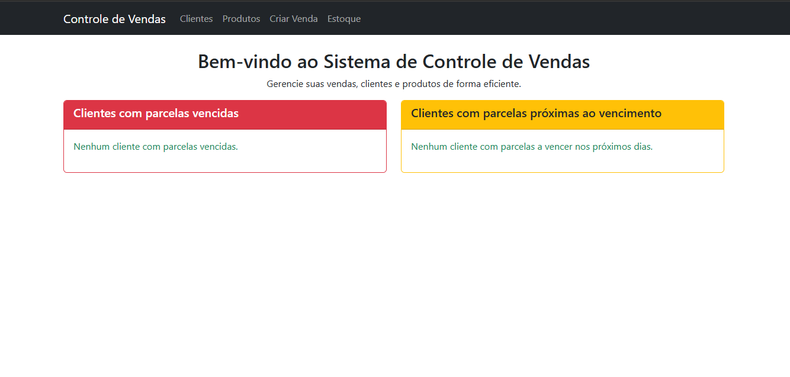

# Sistema de Controle de Vendas e Recebimentos

## Descrição

Este sistema permite o gerenciamento de vendas, parcelas e recebimentos de clientes, incluindo relatórios detalhados, alertas de vencimento e um dashboard interativo.

## Funcionalidades

- **Cadastro de Vendas**: Registra vendas associadas a clientes.
- **Gestão de Parcelas**: Controle de pagamentos e status das parcelas.
- **Relatórios Financeiros**: Exibição de recebimentos e parcelas vencidas/próximas do vencimento.
- **Dashboard de Indicadores**: Gráficos interativos com dados sobre vendas e recebimentos.
- **Alertas de Parcelas**: Notificações de parcelas vencidas e próximas ao vencimento.

## Tecnologias Utilizadas

- **Backend**: Django
- **Banco de Dados**: PostgreSQL
- **Frontend**: HTML, Bootstrap e Chart.js

## 📸 Imagens do Projeto

### Tela de Login  

